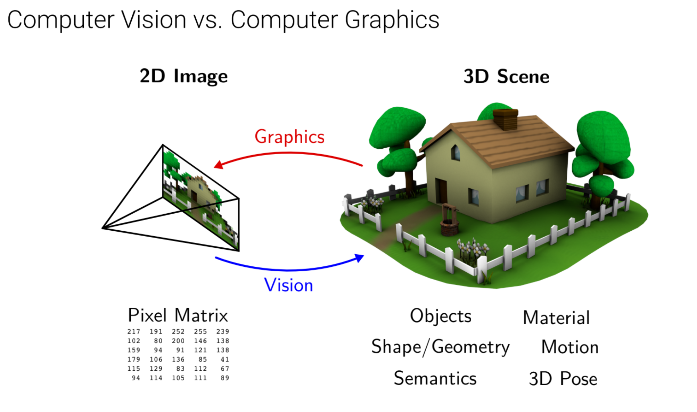
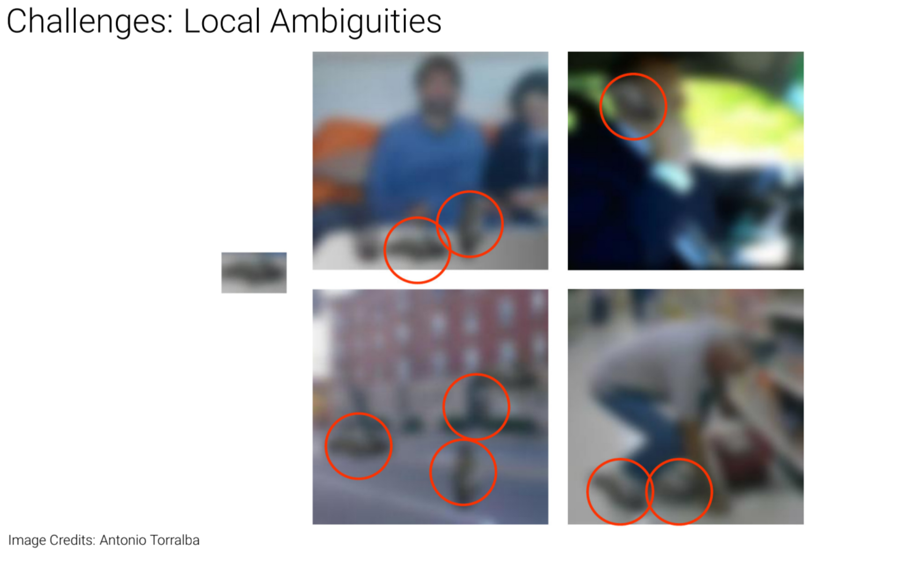

# L01 Introduction

## 1.1 introduction

1. The goal of Computer Vision: convert light into meaning
2. The difference between Computer Vision and Computer Graphics: 

    And from Prof. Baoquan Chen(Peking University): Computer Vision is to teach machine to know, to understand the world while Computer Graphics is to create a new visual world, to make it look real.

1. Why is Vision Perception so hard?
- What Computer sees is quite different from us humans. What they see is just pixel matrix without any real meanings. So the learning process is quite difficult.
- What you see is not always true!
- Different viewpoint variation from the same picture. They come from one picture but look so different.
- Deformation of a project (For example, different types of a painting could look different).
- Occlusion of two or even more projects.
- Illumination conditions. Different processes of a same picture could make the picture look so different.
- Perception and Measurement. Still, what you see is not always true, sometimes it depends on the measurement conditions.
- Local Ambiguities. For pictures not so clear, though for the machine they look very similar, they actually look quite different.

- Intra Class Variation. For the same kind of projects, it may contain so many kinds.
- Number of Object Categories. There are so many kinds of objects!

## 1.2 The history of Computer Vision

I don’t care this section so much now. Apologize for skipping it. Maybe I will review this part one day.