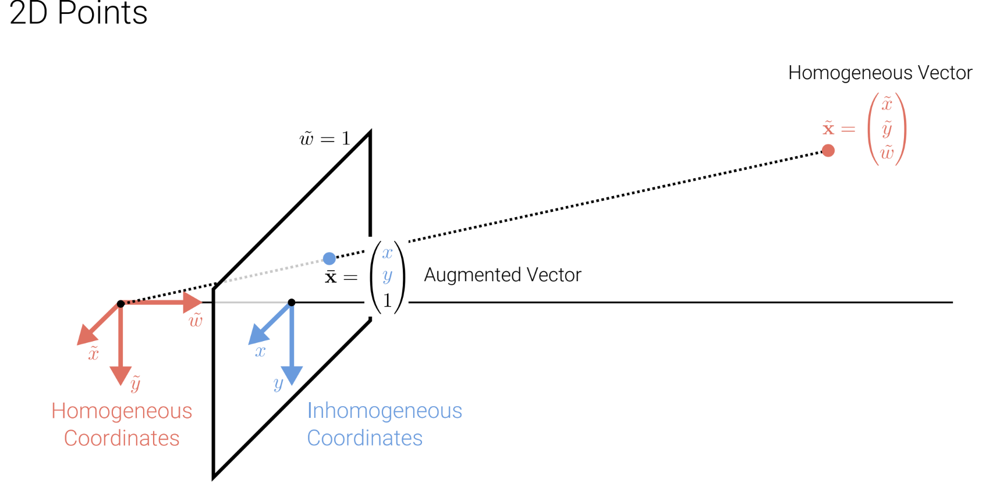
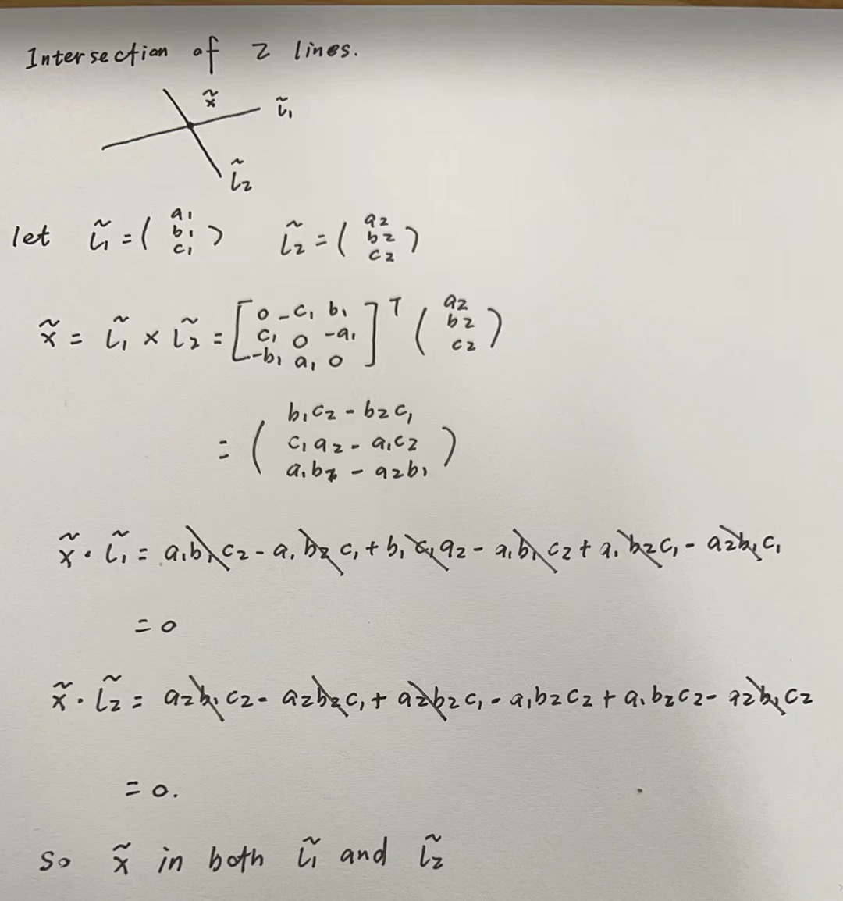
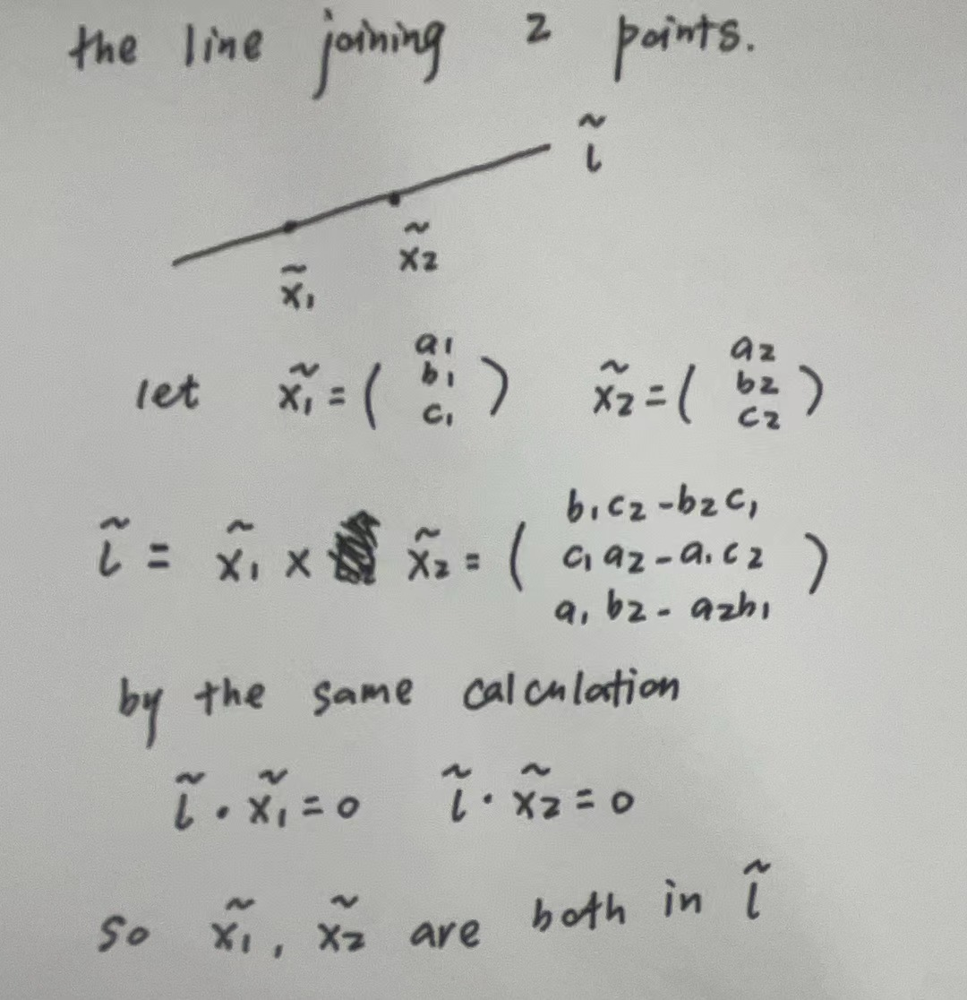

# L02 Image Formation

## 2.1 Primitives and Transformations

- Primitives for describing 3D shapes: Points, Lines, Planes.
    - We all know how to define a point or line or plane in both 2D space or 3D space before, but we will introduce a new tool (new coordinates) called **homogeneous coordinates.** Oppositely, previous coordinates we discuss is called inhomogeneous coordinates. Then what is homogeneous coordinates and why we need it?
        - What is homogeneous coordinates?
            - Compared to inhomogeneous coordinates, homogeneous coordinates will add one more dimension. i.e. a 2D point need (x, y, z) to define and (x, y, z, w) for 3D point as well. And we also use $\tilde{x}$ to denote one vection in homogeneous coodinates.
        - Why we need it?
            1. It allows the **transformation(we will discuss later)** of objects in 3D space in the same formation in linear algebra easily.
            2. It allows to describe points at infinity, we call them ideal points.
        - **Remark**
            
            Homogeneous vectors that differ only by scale are considered equivalent and define an equivalence class. ⇒ Homogeneous vectors are defined only up to scale.
            
        - How to transform a point from homogeneous coordinates to inhomogeneous coordinates and from the opposite direction?
            1. homogeneous coordinates to inhomogeneous coordinates:
                
                $$
                \tilde{\mathbf{x}} = 
                \begin{pmatrix}
                  \tilde{x}\\
                  \tilde{y}\\
                  \tilde{w}\\
                \end{pmatrix} = 
                \begin{pmatrix}
                  \tilde{x}/ \tilde{w}\\
                  \tilde{y} / \tilde{w}\\
                \end{pmatrix} = 
                \mathbf{x}
                $$
                
            2. inhomogeneous coordinates to homogeneous coordinates:
                
                $$
                \mathbf{x} = 
                \begin{pmatrix}
                {x}\\
                {y}\\
                \end{pmatrix} = 
                \begin{pmatrix}
                {x}\\
                {y}\\
                1
                \end{pmatrix} =
                \mathbf{\bar{x}}=
                \begin{pmatrix}
                  \tilde{x}\\
                  \tilde{y}\\
                  \tilde{w}
                \end{pmatrix} = 
                
                \tilde{\mathbf{x}}
                \\ where\ \tilde{x}= x\ * \tilde{w}\quad \tilde{y}= y\ * \tilde{w}\\
                \mathbf{\bar{x}}\ is\ called\  augmented\  vector
                
                $$
                
            
            Homogeneous points whose last element is $\tilde{w}=0$ are called **ideal points** or
            **points at infinity**. These points can’t be represented with inhomogeneous coordinates!
            
        - Projective space
            
            For 2D points in both inhomogeneous coodinates and homogeneous coordinates,  
            
            $$
            \mathbf{x} = 
            \begin{pmatrix}
            {x}\\
            {y}\\
            \end{pmatrix}\in \mathbb{R}^2
            \qquad
            \tilde{\mathbf{x}} = 
            \begin{pmatrix}
              \tilde{x}\\
              \tilde{y}\\
              \tilde{w}\\
            \end{pmatrix}\in \mathbb{P}^2
            $$
            
            where $\mathbb{P}^2 = \mathbb{R}^3 \setminus \{{(0, 0, 0)}\}$ is called **projective space.**
            
            For 3D points,
            
            $$
            \mathbf{x} = 
            \begin{pmatrix}
            {x}\\
            {y}\\
            {z}
            \end{pmatrix}\in \mathbb{R}^3
            \qquad
            \tilde{\mathbf{x}} = 
            \begin{pmatrix}
              \tilde{x}\\
              \tilde{y}\\
              \tilde{z}\\
              \tilde{w}\\
            \end{pmatrix}\in \mathbb{P}^3
            $$
            
            where $\mathbb{P}^3 = \mathbb{R}^4 \setminus \{{(0, 0, 0, 0)}\}$ is called **projective space.**
            
        - Example of 2D points
            
            
            
    - Lines.
        - In inhomegeneous coordinates, we all know how to define a line $\mathbf{\tilde{l}}:ax+by+c=0\in\mathbb{R}^2$ . Then 2D lines can also be expressed using homogeneous coordinates.
        
        $$
        \mathbf{\tilde{l}}=(a,b,c)^\top:\\
        \lbrace \mathbf{\bar{x}}\ |\ \mathbf{\tilde{l}}^\top\mathbf{\bar{x}}=0 \rbrace  \Leftrightarrow
        \lbrace(x,y)\ |\ ax+by+c=0
        \rbrace
        $$
        
        - Normalize the the line $\mathbf{\tilde{l}}$:
            
            $\mathbf{\tilde{l}} = (n_x,n_y,d)^\top = (\mathbf{n},d)\quad with\ \Vert \mathbf{n} \Vert_2=1$
            
            In this case, **n** is the normal vector perpendicular to the line and d is its distance to the origin. (easy to proof)
            
            An exception is the line at infinity $\mathbf{\tilde{l}_\infty}=(0,0,1)^\top$ which passes through all ideal points.
            
        - Cross Product
            
            
            
        - 2D Line Arithmetic
            
            In homogeneous coordinates, the **intersection** of two lines is given by:
            
            $$
            \mathbf{\tilde{x}}=\mathbf{\tilde{l}_1}\ \times\mathbf{\tilde{l}_2}
            $$
            
            Similarly, the **line joining two points** can be compactly written as:
            
            $$
            \mathbf{\tilde{l}}=\mathbf{\bar{x}_1}\ \times\mathbf{\bar{x}_2}
            $$
            
            Proof as followings (latex formation of proof is such a hard work for me, forgive my handwriting)
            
            
            
            
            
        - The followings are 2 example:
        
        
        
        
        
        - 3D Lines
        
        
        
    - 3D Planes.
        
        
        
- Transformations

**Remark**: Since the matrix is equivalent by scaling, we often do a normalization so the last element of $\mathbf{\tilde{H}}$  is 1, which decreases one degree of freedom. (9 ⇒ 8)

## 2.2 Geometric Image Formation

- Pinhole Camera
    
    
    
- 2 kinds of projection model
    - Orthographic Projection: The object in the image plane is the same size as the world space.
    
    
    
    - Perspective Projection: The object in the image plane is smaller than it in the world space.
        
        
        
- Orthographic Projection Model
    
    
    
    
    
    **Remark: Scaled Orthographic Projection**
    
    
    
- Perspective Projection Model
    
    
    
    
    
    $$
    \mathbf{\bar{x}}_c=
    \begin{pmatrix}
      {x}\\
      {y}\\
      {z}\\
      {1}\\
    \end{pmatrix}\qquad 
      \left[
        \begin{array}{}
          f&0&0&0\\
          0&f&0&0\\
          0&0&1&0
        \end{array}
      \right]^\top\mathbf{\bar{x}}_c
    =
    \begin{pmatrix}
      {fx}\\
      {fy}\\
      {z}\\
    \end{pmatrix}
    =
    \begin{pmatrix}
      {fx/z}\\
      {fy/z}\\
      {1}\\
    \end{pmatrix}
    
    $$
    
- Principal Point
    
    
    
    
    
- Something about **s (from GPT-4o)**
    
    
    
    
    
- The whole process of transforming a point in world coordinates to image space.
    
    
    
    
    
- Lens Distortion
    
    
    
    
    
    ## 2.3 Photometric Image Formation
    
- How an image is formed in terms of pixel intensities and colors?
    - Light is emitted by one or more light sources and **reflected** or **refracted** (once or multiple times) at surfaces of objects (or media) in the scene.
    
    
    
    
    
    - The amount of light reflected from a surface depends on the viewing angle
    
    
    
- Why we need different kinds of camera Lensens?
    - Large and very small pinholes result in image blur (averaging, diffraction)
    - Small pinholes require very long shutter times (⇒ motion blur)
    
    
    
    
    
    
    
    ## 2.4 Image Sensing Pipeline
    
    This part is so abstract for me :(
    
    I think I need more background knowledge to understand this section.