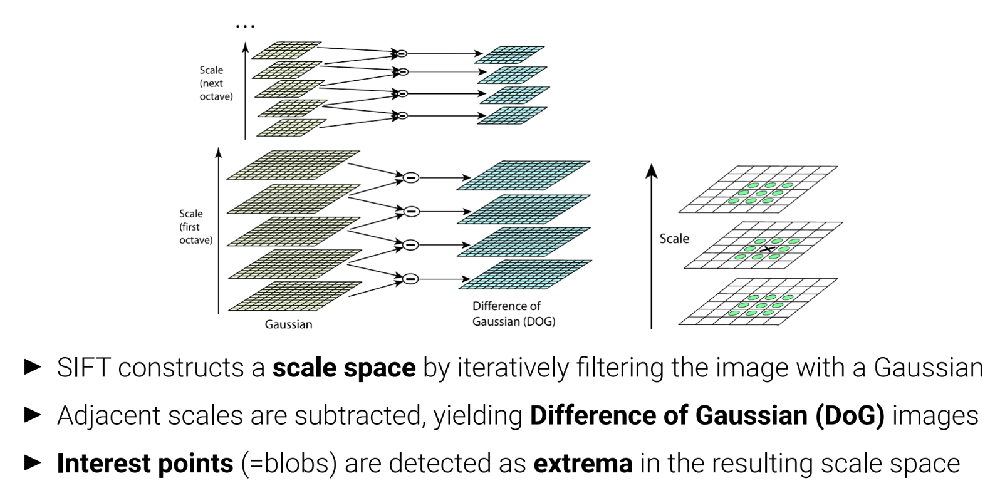

# L03 Structure from Motion

## 3.1 Preliminaries

- **Camera Calibration**
    - Camera calibration is the process of finding the intrinsic/extrinsic parameters.
    - Most commonly, a known calibration target (image, checkerboard) is used.
    - The process of Camera Calibration:
        - First, the known calibration target is captured in different poses.
        - Second, features (e.g., corners) on the target are detected in the images
        - Finally, the camera intrinsics and extrinsics (=poses) are jointly optimized:
            - **Closed-form solution** initializes all parameters except for distortion parameters.
            - **Non-linear optimization** of all parameters by minimizing reprojection errors.
- **Feature Detection and Description**
    - **Point Features**
        - **What** is Point Features and what’s the **use** of it?
            - **Point features** describe the appearance of **local, salient regions** in an image.
            - They can be used to **describe and match images** taken from different viewpoints.
            - They form the **basis of sparse 3D reconstruction methods** covered in this lecture.
        - What **property** should it have?
            - Features should be **invariant to perspective effects** and **illumination**.
            - The same point should have **similar vectors** independent of pose/viewpoint.
            - Plain RGB/intensity patches will not have this property, we need something better.
        - One algorithm: **Scale Invariant Feature Transform (SIFT)**
            - Goal: Local feature description.
            - One idea: We add the same Gaussian noise to one image, if the points in a smooth area, then they will not change a lot, while they will  when they are in a area not so smooth, then those points could be considered as feature points.
            - Process:
                
                
                
                
                

## 3.2 Two-frame Structure from Motion

- **Epipolar Geometry**
    - **Goal**: Recovery of camera pose (and 3D structure) from image correspondences.
    - The required relationships are described by the two-view epipolar geometry.
        
        
        
    - Why the **fourth property** is true?
        - **essential matrix (With $\mathbf{K}$)**
            
            
            
            
            
    - Why the **fifth property** is true?
        
        
        
    - How to get the essential matrix?
        
        
        
    - With $\mathbf{\tilde{E}}$, we can recover $\mathbf{\hat{t}}$ and $\mathbf{R}$
        
        
        
        - **essential matrix (Without $\mathbf{K}$) ⇒ fundamental matrix**
            
            
            
- **Triangulation**
    - **Goal**: Given the camera intrinsics and extrinsics, how can we recover 3D geometry?
    - **Problem**: Given noisy 2D image observations x ̄1 and x ̄2, the two rays might not intersect in one point. We like to recover the 3D point x that (in some sense) is closest to the two rays.
    - **Method**:
        
        
        
        
        
    - **Uncertainty and Trade-off**
        
        
        

## 3.3 & 3.4 to be continued (Maybe after I could understand the linear algebra knowledge)